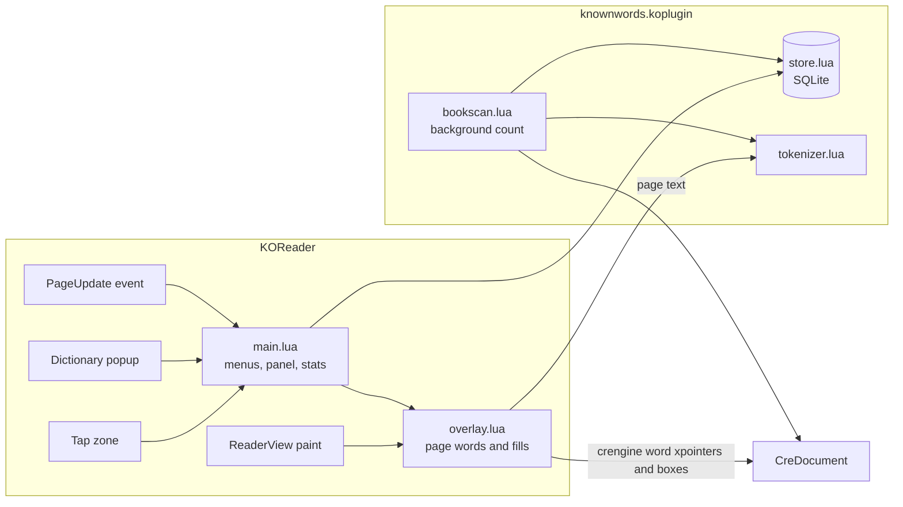

# Known words plugin

A LingQ-style reading aid for KOReader. Every word you have not marked as known is colored on the page by its state. You tap a word to change its state, and the plugin keeps statistics of how many words you know. Everything is stored on the device; nothing is synced.

Target device: Kobo Libra Colour (Kaleido 3 color e-ink). Target language: Spanish, although nothing in the code is Spanish-only.

Code: `plugins/knownwords.koplugin/`. Tests: `spec/unit/knownwords_spec.lua`.

## Scope

In scope:

- Word states: new, learning levels 1–3, known, ignored.
- Colored fills on the page for new and learning words, one distinct color per state.
- A word panel on tap: state buttons, the sentence being read, your meanings (each tied to the sentence it was written for), notes, and a button that translates the sentence.
- A state button row in the dictionary popup.
- "Mark new words on this page as known", and an optional LingQ-style setting that does it on every page turn (off by default).
- Statistics: known words overall and over time, the current book's known share, and daily reading activity.
- A word list, and CSV import and export.

Out of scope: audio, listening, spaced repetition review, syncing, shared content, word-form (lemma) grouping.

## Behavior

### States

| State | Stored as | Default color | On the page |
| --- | --- | --- | --- |
| New | no row, or 0 | Blue | Filled (can be turned off) |
| Level 1 | 1 | Red | Filled |
| Level 2 | 2 | Orange | Filled |
| Level 3 | 3 | Green | Filled |
| Known | 4 | — | Plain |
| Ignored | 5 | — | Plain, left out of all percentages |

Colors come from KOReader's highlight palette (`Blitbuffer.HIGHLIGHT_COLORS`), so they are the ones already tuned for color e-ink. Each color can be changed. Fills are lightened toward white by a "color intensity" setting (default 50 %), because full-strength fills on Kaleido reduce text contrast. With color rendering off, learning levels are shown as three gray levels and new words are underlined.

A word is its normalized form. The same word has the same state in every book of the same language.

### Interaction

- **Tap a word** (any word, known ones included) to open the word panel. Taps outside words (margins, between lines) still turn pages, as do swipes and page buttons. A setting limits this to colored words, or turns it off.
- **Meanings per sentence**: a word can mean different things in different sentences (*banco*: bank, bench). Each meaning you add keeps the sentence it was written for. The panel lists all of a word's meanings and marks the one written for the current sentence.
- **Translate sentence**: translates the current sentence, and the word on its own, with KOReader's translator (Google Translate). It needs Wi-Fi, and KOReader offers to turn it on. The view marks the word in the sentence and, when one of the word's translations occurs in the translated sentence, marks it there too (best effort: `translation.lua`). It also lists the word's translations. The view opens over the panel.
- **State buttons in the dictionary popup** set the state and close the popup. When the dictionary was opened from the word panel, closing it without choosing a state returns to the panel.
- **Long-press a word** to look it up as usual. The dictionary popup gets a row of state buttons. A lookup of a new word makes it level 1; this can be turned off in settings.
- **Mark new words on this page as known**: from the menu, or from any gesture or key via the dispatcher action.
- **Turning the page marks its new words as known**: a setting, off by default. It makes counts grow fast, but it also counts words you skimmed.
- **Show or hide colors**: a dispatcher action, to read a page without fills.

### Which books are tracked

A book is tracked if its language (from its metadata) is in the tracked languages list (default: `es`). Each book can be forced on or off from the plugin menu, which covers books with missing or wrong language metadata. Only reflowable documents (EPUB, FB2, HTML, TXT and so on) are supported, and only in page view mode.

### Statistics

| Figure | Definition |
| --- | --- |
| Known words | Words in state known |
| Learning (1 / 2 / 3) | Words at each level |
| Known, unique words (book) | Known distinct words in the book ÷ distinct words that are not ignored |
| Known, running text (book) | Occurrences of known words ÷ all word occurrences that are not ignored |
| Known on this page | The same as running text, for the current page |
| Words read | Words on pages you turned forward from, each page counted once per session |
| New known words per day | Words whose latest change made them known that day |
| Known total per day | Known words at the end of each day, over the last 30 days |
| Lookups | Dictionary lookups per day |

"Known words" counts the words you have marked, not an estimate of your vocabulary. Inflected forms count separately, so *hablo*, *hablas* and *habló* are three words, as in LingQ.

## Architecture

| File | Role |
| --- | --- |
| `main.lua` | Plugin lifecycle, settings, menus, tap handling, word panel, dictionary buttons, statistics, word list, import and export |
| `overlay.lua` | ReaderView view module that collects the current page's words and paints their fills |
| `bookscan.lua` | Counts every word of the book in the background |
| `store.lua` | SQLite schema and queries |
| `tokenizer.lua` | Word splitting and normalization (pure Lua) |
| `states.lua` | State constants, names and default colors |
| `csv.lua` | CSV reading and writing (pure Lua) |
| `translation.lua` | Marks the word in the sentence and in its translation for the translation view (pure Lua) |

### Page overlay

On paint, the overlay walks crengine's words from the page start to the next page's start:

1. Start at `getNextVisibleWordStart(getPrevVisibleChar(page_start))`. This includes a word that starts exactly at the page start and skips the tail of a word hyphenated from the previous page.
2. For each word: `getNextVisibleWordEnd` gives its end, `getTextFromXPointers` its text, and `getWordBoxesFromPositions` (word mode, not line segments) its screen boxes. A word hyphenated across lines gets one box per line.
3. Stop at the next page's start xpointer, or at the end of the document.

The result is cached under a key made of the rendering hash, the position, the page, and the screen size. A state change only repaints fills, from the cache and the in-memory state table, without walking crengine again. Every new page costs one walk of about 4 crengine calls per word. **Tools → Measure page speed** reports that cost on the device.

The overlay returns `true` from `paintTo` when it painted in color. A small core change in `ReaderView:paintTo` counts that like colored highlights, so the Kaleido color waveform is used for the page.

### Book scan

Book stats need the count of every word in the book. The scan reads the text in chunks of 8 pages with `getTextFromXPointers` and counts words with the same tokenizer. Each chunk end is moved to the end of the word it falls in, so words hyphenated across a page break are not split. The last page is read word by word, because there is no xpointer after it.

The scan runs in slices of about 120 ms scheduled on the UI loop, so reading continues while it runs. It restarts if the layout changes, and the result is cached per book (partial MD5) together with the tokenizer version.

### Tokenization

The overlay gets its words from crengine and the scan from `tokenizer.lua`, so the two must split the same way. The tokenizer mirrors crengine's `IsWordChar` and `IsWordBoundary`: a word is a run of letters, combining marks and digits, and punctuation, apostrophes, hyphens and spaces end it. Normalization removes soft hyphens and applies Unicode case folding with NFKC (`Utf8Proc.lowercase`), so capitalized, accented and decomposed forms match. Tokens without a letter, such as numbers, are not tracked.

Consequence: `l'homme` is two words and `niño-a` is two words, exactly as crengine selects them. That is fine for Spanish.

## Data model

One SQLite file: `settings/known_words.sqlite3`.

| Table | Key | Columns | Notes |
| --- | --- | --- | --- |
| `word` | (lang, word) | state, notes, context, book_title, lookups, created_at, updated_at, known_at | A row exists once a word has a state other than new, a lookup, a meaning or notes. `context` is the first sentence the word was met in. The `meaning` column is unused since version 2 |
| `meaning` | id | lang, word, meaning, context, book_title, created_at | Any number per word; `context` is the sentence the meaning was written for. Version 2 moved each word's single meaning here |
| `event` | id | lang, word, kind, from_state, to_state, book_md5, at | Append-only: `state`, `lookup`, `lookup_level1`, `page_known`, `auto_known`, `import` |
| `daily` | (lang, day) | words_read, pages_read | Local dates |
| `book` | md5 | title, lang, total_words, unique_words, tokenizer_version, scanned_at | Scan metadata |
| `book_word` | (md5, word) | count | Scan result |

Nothing reads the event log yet. It is kept so that a later knowledge model, or a better "new known words per day" history, can be computed from real data. Book stats are one `GROUP BY` over `book_word` joined with `word`.

## Import and export

Export writes `known_words_<lang>.csv` to the home folder with the columns word, state, meaning (all meanings, joined with "; "), notes, context, book, created and known. Import reads a CSV whose columns are word, state (0–5, `new`, `known` or `ignored`; empty means known) and an optional meaning, which is added unless the word already has it. A header row is skipped. Words are normalized as in the reader. Import is how to seed known words, for example from a LingQ export.

## Changes outside the plugin

- `frontend/apps/reader/modules/readerview.lua`: a view module's `paintTo` returning `true` marks the page as colorful, for the Kaleido waveform.
- `frontend/ui/elements/reader_menu_order.lua`: the plugin's menu entry sits under Tools, after Reading statistics.
- `frontend/ui/widget/dictquicklookup.lua`: plugin dictionary buttons accept a `background` color, and a popup with colored buttons refreshes with the Kaleido color waveform. The state buttons use the same colors as the page.

The plugin also works when copied alone into an unmodified KOReader. It then passes the button colors through itself, with a small wrapper around `DictQuickLookup.populatePluginButtons`. It cannot switch the waveform there, so on a Kaleido screen the colors may look paler than on this fork.

## Known limitations

- **Untested on a device.** The unit tests run the overlay and scan logic against a fake document that implements crengine's word navigation. The real crengine calls, the speed and the colors still need checking on the Libra Colour.
- Scroll view mode: no colors and no taps.
- `getTextFromXPointers` resets crengine's own selection, so a search-hit highlight may disappear at the next repaint of that page.
- A word split across inline elements (for example a drop cap in its own ``) is two words to crengine but one to the scan.
- Tapping a colored word that is also part of a saved highlight may open the word panel instead of the highlight dialog; which one wins depends on touch zone registration order.
- Statistics are only available with a book open.

## Possible next steps

- Lemma grouping for Spanish (from Wiktionary inflection tables), so conjugations share one state.
- Statistics per chapter, and from the file manager.
- Phrases (multi-word terms).
- Scroll mode support.
